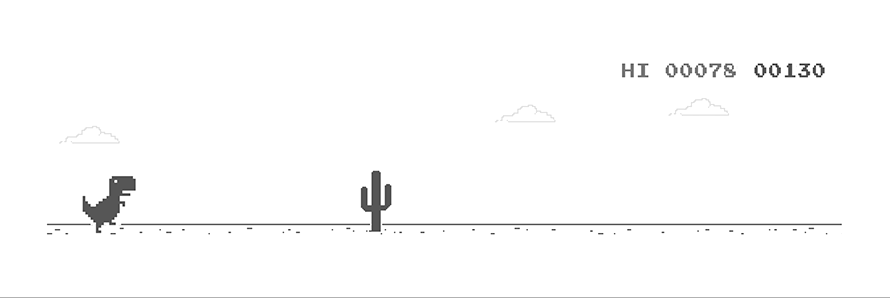

  

# Olá, eu sou o RafaeL Malaquias 👋

Desenvolvedor front-end com foco em **JavaScript, HTML e CSS**, construindo aplicações web interativas e consumindo APIs. Também estudo **Docker e infraestrutura** aplicada a ambientes de servidor.

## Tecnologias em prática

- JavaScript (vanilla)
- HTML5 e CSS3
- Consumo de APIs REST
- Git e GitHub
- Docker (em aprendizado prático)

## Projetos em destaque

### 1) FocusTimer-V2.0
Aplicação Pomodoro em JavaScript vanilla, com modularização, controle de estado, eventos, sons e deploy no GitHub Pages.
- Repositório: https://github.com/RafaeL-Malaquias/FocusTimer-V2.0
- Demo: https://rafael-malaquias.github.io/FocusTimer-V2.0/

### 2) Pokodex-PokeAPI
Aplicação em JavaScript que consome a PokéAPI e renderiza informações de Pokémon na interface.
- Repositório: https://github.com/RafaeL-Malaquias/Pokodex-PokeAPI

### 3) Projeto-Discover
Projeto front-end interativo em HTML, CSS e JavaScript com uso de dados em JSON.
- Repositório: https://github.com/RafaeL-Malaquias/Projeto-Discover

### 4) Docker-MTA-Server
Projeto relacionado a servidor MTA/FiveM com scripts Lua e experimentos de containerização com Docker.
- Repositório: https://github.com/RafaeL-Malaquias/Docker-MTA-Server

## Contato

- GitHub: https://github.com/RafaeL-Malaquias
