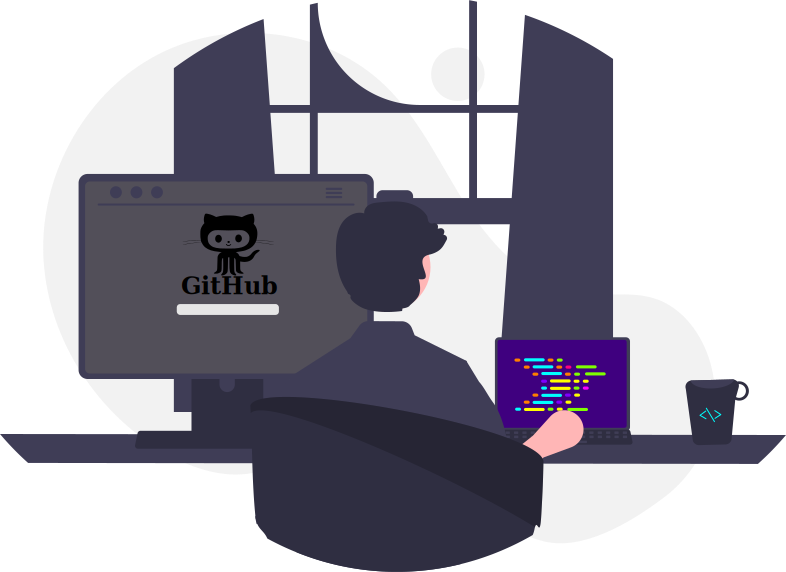

<h1>Hey There! 👋</h1>

Hi, I'm Rafael. Currently, I'm immersed in my studies to become a web developer. My passion is to achieve proficiency in programming to create efficient and scalable web applications.
    
While I have experience in computer maintenance, my focus now lies in the intensive journey of learning programming.
    
I'm adept at diagnosing and solving hardware and software issues, and I feel comfortable working with different operating systems and applications.

My affinity for technology emerged early, fueled by curiosity about how things work. I'm determined to keep learning and growing in this field to become an expert in web development.

Furthermore, my passion for technology and games aligns with my desire to apply my skills to help others. I'm excited about the opportunities to contribute to the dynamic world of programming and eager for the challenges ahead.

 

 🌱 I'm currently learning - HTML - CSS - JS
    
 🤔 I'm looking for help with Web Development
    
 💬 Can you ask me about Computer and Games...
    
 ⚡ Curiosity: I love coffee and playing games at night!
       

  

<h1>🖥️ Technologies and Tools:</h1>

  
 

  
  
  ##
  

  
  
  
   
  
   

 

 
 
 
 

      
      
      

